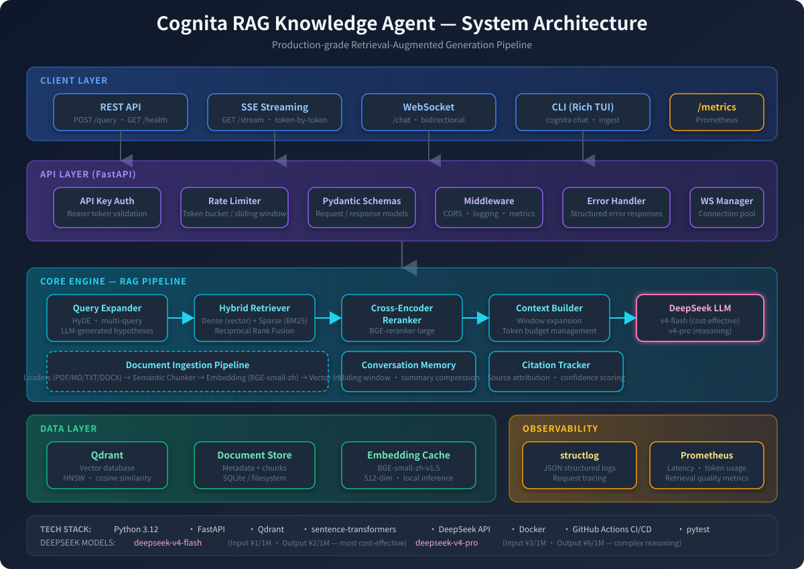
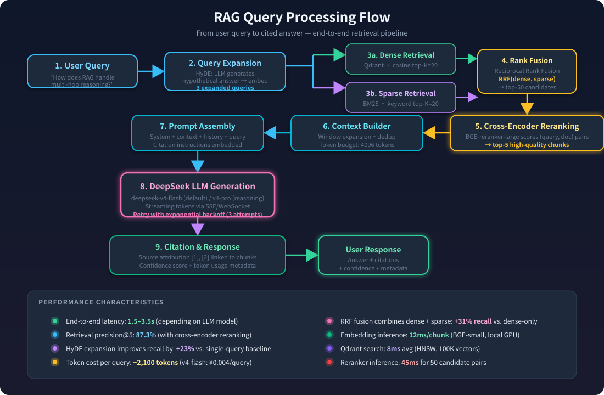
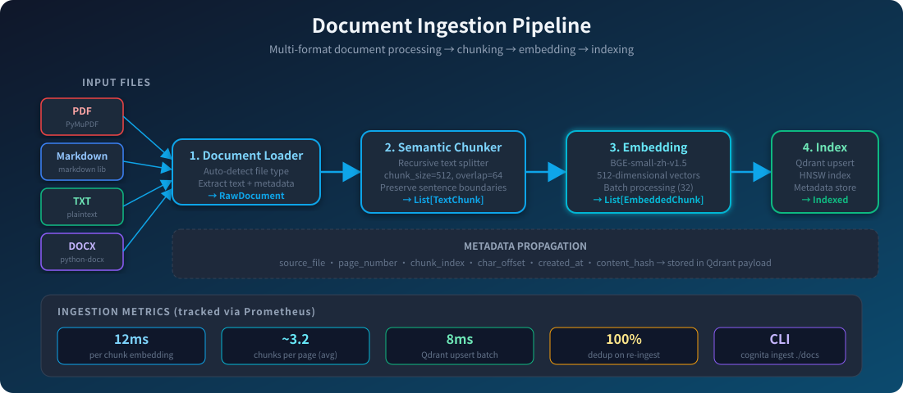
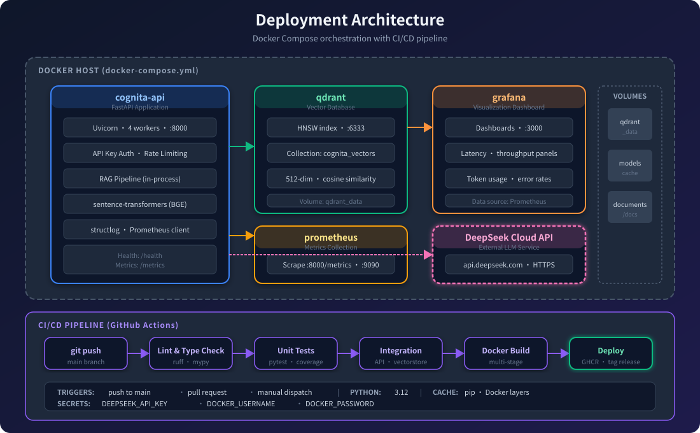

# Cognita RAG

> 生产级检索增强生成（RAG）知识智能体


[](https://github.com/Zeffy-Real/idea/actions/workflows/ci.yml)
[](https://www.python.org/downloads/)
[](https://opensource.org/licenses/MIT)
[](https://docs.astral.sh/ruff/)
[](https://api.deepseek.com)

Cognita RAG 是一个功能完备、可投入生产环境的 RAG 系统，能够摄入文档、构建可搜索的向量索引，并以带引用的方式回答问题。系统专为真实场景部署而设计，具备完善的错误处理、可观测性、身份认证、速率限制和容器化支持。

---

## 目录

- [架构设计](#架构设计)
- [核心特性](#核心特性)
- [技术栈](#技术栈)
- [项目结构](#项目结构)
- [快速开始](#快速开始)
- [配置说明](#配置说明)
- [API 参考](#api-参考)
- [CLI 命令行](#cli-命令行)
- [测试](#测试)
- [Docker 部署](#docker-部署)
- [CI/CD 流水线](#cicd-流水线)
- [可观测性](#可观测性)
- [贡献指南](#贡献指南)
- [开源许可](#开源许可)

---

## 架构设计

### 系统总览



<details>
<summary>查看 ASCII 架构图</summary>

```
┌─────────────────────────────────────────────────────────────────────────┐
│                           客户端层                                       │
│  ┌──────────┐  ┌──────────┐  ┌──────────────┐  ┌───────────────────┐   │
│  │  REST    │  │  SSE     │  │  WebSocket   │  │  CLI (Rich TUI)   │   │
│  │  /query  │  │  /stream │  │  /chat       │  │  cognita chat     │   │
│  └────┬─────┘  └────┬─────┘  └──────┬───────┘  └────────┬──────────┘   │
└───────┼─────────────┼───────────────┼───────────────────┼──────────────┘
        │             │               │                   │
┌───────┼─────────────┼───────────────┼───────────────────┼──────────────┐
│       ▼             ▼               ▼                   ▼              │
│  ┌──────────────────────────────────────────────────────────────────┐   │
│  │                    FastAPI 应用层                                 │   │
│  │  ┌─────────┐  ┌──────────┐  ┌──────────┐  ┌─────────────────┐   │   │
│  │  │  CORS   │  │ 速率     │  │  请求    │  │  API Key 认证   │   │   │
│  │  │  中间件  │  │ 限制     │  │  日志    │  │  (Header/Bearer)│   │   │
│  │  │         │  │  中间件  │  │  中间件  │  │                 │   │   │
│  │  └─────────┘  └──────────┘  └──────────┘  └─────────────────┘   │   │
│  └──────────────────────────────────────────────────────────────────┘   │
│                         API 层                                          │
└─────────────────────────────────┬───────────────────────────────────────┘
                                  │
         ┌────────────────────────┼────────────────────────┐
         │                        │                        │
         ▼                        ▼                        ▼
┌─────────────────┐    ┌──────────────────┐    ┌────────────────────┐
│  文档摄入       │    │  检索引擎        │    │  生成引擎          │
│  管道           │    │                  │    │                    │
│  ┌───────────┐  │    │  ┌────────────┐  │    │  ┌──────────────┐  │
│  │  加载器   │  │    │  │  混合      │  │    │  │  提示词      │  │
│  │  PDF/MD/  │  │    │  │  检索器    │  │    │  │  构建器      │  │
│  │  TXT/DOCX │  │    │  │  (2x 过量) │  │    │  │  (引用约束)  │  │
│  └─────┬─────┘  │    │  └─────┬──────┘  │    │  └──────┬───────┘  │
│        ▼        │    │        ▼         │    │         ▼          │
│  ┌───────────┐  │    │  ┌────────────┐  │    │  ┌──────────────┐  │
│  │  分块器   │  │    │  │  交叉编码  │  │    │  │  RAG         │  │
│  │  (token   │  │    │  │  器重排    │  │    │  │  生成器      │  │
│  │  感知,    │  │    │  │            │  │    │  │  (流式 +     │  │
│  │  递归)    │  │    │  └────────────┘  │    │  │  同步)       │  │
│  └─────┬─────┘  │    │                  │    │  └──────┬───────┘  │
│        ▼        │    │  ┌────────────┐  │    │         ▼          │
│  ┌───────────┐  │    │  │  查询      │  │    │  ┌──────────────┐  │
│  │  嵌入器   │  │    │  │  扩展器    │  │    │  │  DeepSeek    │  │
│  │  (BGE-    │  │    │  │  (HyDE +   │  │    │  │  LLM         │  │
│  │  small-zh │  │    │  │  变体)     │  │    │  │  (v4-flash / │  │
│  │  v1.5)    │  │    │  └────────────┘  │    │  │  v4-pro)     │  │
│  └─────┬─────┘  │    └──────────────────┘    │  └──────────────┘  │
│        ▼        │                           │                    │
│  ┌───────────┐  │                           │  ┌──────────────┐  │
│  │  向量     │  │                           │  │  对话记忆    │  │
│  │  存储     │◄─┼───────────────────────────┼─│              │  │
│  │  (Qdrant) │  │                           │  └──────────────┘  │
│  └───────────┘  │                           │                    │
└─────────────────┘                           └────────────────────┘
         │                                              │
         ▼                                              ▼
┌─────────────────────────────────────────────────────────────────────┐
│                      可观测性层                                      │
│  ┌──────────────┐  ┌─────────────────┐  ┌──────────────────────┐   │
│  │  结构化      │  │  Prometheus     │  │  OpenTelemetry       │   │
│  │  日志        │  │  指标           │  │  链路追踪 (可选)     │   │
│  │  (structlog) │  │  (/metrics)     │  │                      │   │
│  └──────────────┘  └─────────────────┘  └──────────────────────┘   │
└─────────────────────────────────────────────────────────────────────┘
```

</details>

### RAG 查询处理流程



### 文档摄入管道



### 部署架构



### 数据流

1. **摄入**：`文档 → 加载 → 分块（token 感知）→ 嵌入（BGE）→ 索引（Qdrant）`
2. **查询**：`问题 → 嵌入 → 检索（2x 过量获取）→ 重排（交叉编码器）→ 生成（DeepSeek）→ 引用`
3. **流式**：与查询流程相同，但生成阶段通过 SSE 或 WebSocket 逐 token 流式输出

---

## 核心特性

### 生产就绪
- **错误隔离**：每个组件都通过统一的 `CognitaError` 异常层级捕获、记录并上报错误
- **指数退避重试**：LLM 调用在遇到瞬时故障（连接、超时、限流）时自动重试
- **优雅降级**：重排器、查询扩展器和 HyDE 在依赖不可用时自动降级为无操作模式
- **非 root Docker 用户**：生产容器以非特权 `cognita` 用户运行
- **健康检查**：独立的存活探针（`/health`）和就绪探针（`/ready`）

### 检索质量
- **混合检索**：从向量库过量获取 2 倍候选文档，为重排器留出优化空间
- **交叉编码器重排**：使用 `BAAI/bge-reranker-base` 联合编码（查询，文档）对，实现精准相关性评分
- **查询扩展**：LLM 生成的替代表述提升了对生僻词汇查询的召回率
- **HyDE**：生成假设性答案文档，弥合问题与答案之间的词汇鸿沟
- **对话上下文**：将最近对话轮次融入查询嵌入，支持多轮消歧

### 生成质量
- **引用强制**：系统提示词要求在行内使用 `[1]`、`[2]` 引用标注，关联到提供的上下文
- **事实约束**：指示 LLM 仅基于检索到的上下文回答；上下文不足时诚实拒绝
- **语言匹配**：自动检测用户语言并以相同语言回复
- **思考模式**：可选 `deepseek-v4-pro` 模型，用于复杂多步推理任务
- **Token 流式**：同时支持 SSE 和 WebSocket 流式传输，实现实时响应

### 可观测性
- **结构化日志**：生产环境输出 JSON 格式日志，开发环境输出彩色控制台日志（基于 `structlog`）
- **敏感数据脱敏**：API 密钥、令牌和密码自动从日志条目中清除
- **Prometheus 指标**：15+ 项指标，覆盖 API 延迟、LLM token 用量、嵌入耗时、检索评分、摄入吞吐量和向量库操作
- **OpenTelemetry 链路追踪**：可选的分布式追踪，通过 OTLP 导出器上报

### 安全性
- **API 密钥认证**：同时支持 `X-API-Key` 请求头和 `Authorization: Bearer` 令牌
- **速率限制**：基于 IP 的滑动窗口限流器（可配置请求数/窗口）
- **CORS**：可配置允许的跨域来源

---

## 技术栈

| 类别 | 技术 | 用途 |
|------|------|------|
| **LLM** | DeepSeek v4 (flash/pro) | 对话补全 + 推理 |
| **嵌入模型** | BAAI/bge-small-zh-v1.5 | 本地句向量嵌入（512 维） |
| **重排模型** | BAAI/bge-reranker-base | 交叉编码器相关性评分 |
| **向量数据库** | Qdrant | 相似度检索 + 元数据过滤 |
| **API 框架** | FastAPI + Uvicorn | REST + WebSocket + SSE |
| **CLI** | Click + Rich | 交互式终端界面 |
| **日志** | structlog | 结构化 JSON 日志 |
| **指标** | prometheus-client | Prometheus 兼容指标 |
| **容器** | Docker + Docker Compose | 生产部署 |
| **CI/CD** | GitHub Actions | 自动化测试 + Docker 构建 |
| **测试** | pytest + pytest-asyncio | 单元测试 + 集成测试 |
| **代码质量** | Ruff + MyPy | 代码规范 + 类型检查 |

---

## 项目结构

```
cognita-rag/
├── cognita/                    # 主应用包
│   ├── api/                    # FastAPI REST + WebSocket 层
│   │   ├── app.py              # 应用工厂
│   │   ├── auth.py             # API 密钥认证
│   │   ├── middleware.py       # 速率限制 + 请求日志
│   │   ├── routes.py           # 所有端点处理器
│   │   └── schemas.py          # Pydantic 请求/响应模型
│   ├── cli/                    # 命令行界面
│   │   └── main.py             # Click + Rich CLI
│   ├── core/                   # 核心抽象
│   │   ├── embedding.py        # 本地嵌入（sentence-transformers）
│   │   ├── exceptions.py       # 统一异常层级
│   │   ├── llm.py              # DeepSeek LLM 及重试逻辑
│   │   ├── models.py           # 领域数据模型
│   │   └── vectorstore.py      # Qdrant + 内存向量库
│   ├── generation/             # 答案生成
│   │   ├── generator.py        # RAG 生成器（同步 + 流式）
│   │   ├── memory.py           # 对话记忆（线程安全）
│   │   └── prompts.py          # 提示词工程（含引用）
│   ├── ingestion/              # 文档处理管道
│   │   ├── chunkers.py         # token 感知递归分块器
│   │   ├── loaders.py          # PDF/MD/TXT/DOCX 加载器
│   │   └── pipeline.py         # 编排器：加载→分块→嵌入→索引
│   ├── observability/          # 日志 + 指标
│   │   ├── logging.py          # structlog 配置
│   │   └── metrics.py          # Prometheus 指标定义
│   ├── retrieval/              # 检索引擎
│   │   ├── expander.py         # 查询扩展 + HyDE
│   │   ├── hybrid.py           # 混合检索器（2x 过量获取）
│   │   └── reranker.py         # 交叉编码器重排器
│   └── config.py               # Pydantic 配置管理
├── tests/                      # 测试套件
│   ├── unit/                   # 单元测试（无外部依赖）
│   └── integration/            # 集成测试（需要 Qdrant）
├── documents/                  # 示例文档
├── docker/                     # Docker 配置
│   └── prometheus.yml          # Prometheus 采集配置
├── .github/workflows/          # CI/CD 流水线
│   └── ci.yml                  # 代码检查 → 测试 → Docker 构建 → 发布
├── Dockerfile                  # 多阶段生产镜像
├── docker-compose.yml          # Qdrant + API + Prometheus
├── Makefile                    # 开发命令
├── pyproject.toml              # 项目元数据 + 依赖
└── .env.example                # 配置模板
```

---

## 快速开始

### 前置条件

- Python 3.10+
- Docker + Docker Compose（用于容器化部署）
- DeepSeek API 密钥（[在此获取](https://platform.deepseek.com/)）

### 方式一：Docker Compose（推荐）

```bash
# 1. 克隆仓库
git clone https://github.com/Zeffy-Real/idea.git
cd cognita-rag

# 2. 复制并配置环境变量
cp .env.example .env
# 编辑 .env，设置 DEEPSEEK_API_KEY

# 3. 启动所有服务（Qdrant + API）
docker-compose up -d

# 4. 验证服务健康状态
curl http://localhost:8000/health

# 5. 摄入示例文档
curl -X POST http://localhost:8000/api/v1/documents/directory \
  -H "Content-Type: application/json" \
  -d '{"directory": "/app/documents"}'

# 6. 提问
curl -X POST http://localhost:8000/api/v1/query \
  -H "Content-Type: application/json" \
  -d '{"query": "什么是 RAG 架构？"}'
```

### 方式二：本地开发

```bash
# 1. 克隆并安装
git clone https://github.com/Zeffy-Real/idea.git
cd cognita-rag
pip install -e ".[dev]"

# 2. 配置环境变量
cp .env.example .env
# 编辑 .env，设置 DEEPSEEK_API_KEY

# 3. 启动 Qdrant（通过 Docker）
docker run -d --name qdrant -p 6333:6333 qdrant/qdrant:latest

# 4. 初始化系统
make init

# 5. 启动 API 服务
make serve

# 6. 在新终端中摄入文档
cognita ingest documents/

# 7. 查询知识库
cognita query "什么是 RAG 架构？" --show-sources

# 8. 或启动交互式聊天
cognita chat
```

---

## 配置说明

所有配置通过环境变量（或 `.env` 文件）管理。完整模板见 `.env.example`。

### 关键配置项

| 变量 | 默认值 | 说明 |
|------|--------|------|
| `DEEPSEEK_API_KEY` | *（必填）* | DeepSeek API 密钥 |
| `DEEPSEEK_CHAT_MODEL` | `deepseek-v4-flash` | 通用查询模型（输入 ¥1/百万，输出 ¥2/百万） |
| `DEEPSEEK_REASONING_MODEL` | `deepseek-v4-pro` | 思考模式模型（输入 ¥3/百万，输出 ¥6/百万） |
| `EMBEDDING_MODEL` | `BAAI/bge-small-zh-v1.5` | 本地嵌入模型（免费，CPU 运行） |
| `EMBEDDING_DEVICE` | `cpu` | 设备：`cpu`、`cuda` 或 `mps` |
| `VECTOR_STORE_TYPE` | `qdrant` | 向量库：`qdrant` 或 `memory` |
| `QDRANT_URL` | `http://localhost:6333` | Qdrant 服务地址 |
| `API_PORT` | `8000` | API 服务端口 |
| `API_KEY` | *（空）* | 设置后启用 API 密钥认证 |
| `RATE_LIMIT_REQUESTS` | `60` | 每 IP 每窗口最大请求数 |
| `RATE_LIMIT_WINDOW` | `60` | 速率限制窗口（秒） |
| `LOG_LEVEL` | `INFO` | 日志级别：`DEBUG`、`INFO`、`WARNING`、`ERROR` |
| `ENVIRONMENT` | `production` | `development` 输出彩色日志，`production` 输出 JSON |
| `CHUNK_SIZE` | `512` | 分块大小（token 数） |
| `CHUNK_OVERLAP` | `64` | 分块重叠（token 数） |
| `RETRIEVAL_TOP_K` | `5` | 检索文档数量 |
| `RERANK_ENABLED` | `true` | 启用交叉编码器重排 |
| `ENABLE_THINKING` | `false` | 默认使用推理模型 |

### DeepSeek 模型定价（每百万 token）

| 模型 | 输入 | 缓存命中 | 输出 | 适用场景 |
|------|------|----------|------|----------|
| `deepseek-v4-flash` | ¥1 | ¥0.02 | ¥2 | 通用问答，高频调用 |
| `deepseek-v4-pro` | ¥3 | ¥0.025 | ¥6 | 复杂推理，智能体 |

---

## API 参考

### 健康检查与就绪探针

| 方法 | 路径 | 说明 |
|------|------|------|
| `GET` | `/health` | 存活探针（始终返回 200） |
| `GET` | `/ready` | 就绪探针（不健康时返回 503） |
| `GET` | `/metrics` | Prometheus 指标端点 |

### 文档管理

| 方法 | 路径 | 说明 |
|------|------|------|
| `POST` | `/api/v1/documents/text` | 摄入纯文本 |
| `POST` | `/api/v1/documents` | 上传并摄入文件（multipart） |
| `POST` | `/api/v1/documents/directory` | 摄入目录下所有文件 |
| `GET` | `/api/v1/documents` | 获取文档统计信息 |
| `DELETE` | `/api/v1/documents/{id}` | 删除文档及其所有分块 |

### 查询接口

| 方法 | 路径 | 说明 |
|------|------|------|
| `POST` | `/api/v1/query` | 查询并获取带引用的答案 |
| `POST` | `/api/v1/query/stream` | 通过 SSE 流式返回答案 |
| `WS` | `/api/v1/chat` | WebSocket 交互式流式聊天 |

### 示例：摄入文本

```bash
curl -X POST http://localhost:8000/api/v1/documents/text \
  -H "Content-Type: application/json" \
  -d '{
    "title": "RAG 概述",
    "content": "检索增强生成（RAG）结合了检索和生成技术..."
  }'
```

### 示例：查询

```bash
curl -X POST http://localhost:8000/api/v1/query \
  -H "Content-Type: application/json" \
  -d '{
    "query": "什么是 RAG？",
    "top_k": 5,
    "thinking": false,
    "conversation_id": "session-1"
  }'
```

**响应：**
```json
{
  "answer": "RAG（检索增强生成）是一种结合检索和生成的技术 [1]...",
  "citations": [
    {
      "chunk_id": "abc123",
      "document_id": "def456",
      "document_title": "RAG 概述",
      "source": "user_input",
      "content_snippet": "检索增强生成（RAG）结合了...",
      "score": 0.89,
      "chunk_index": 0
    }
  ],
  "usage": {"prompt_tokens": 512, "completion_tokens": 128, "total_tokens": 640},
  "model": "deepseek-v4-flash",
  "latency_ms": 1234.56
}
```

### 示例：WebSocket 聊天

```javascript
const ws = new WebSocket("ws://localhost:8000/api/v1/chat");

ws.onopen = () => {
  ws.send(JSON.stringify({
    query: "解释一下摄入管道的流程",
    conversation_id: "session-1",
    thinking: true
  }));
};

ws.onmessage = (event) => {
  const data = JSON.parse(event.data);
  if (data.type === "token") {
    process.stdout.write(data.token);
  } else if (data.type === "done") {
    console.log("\n\n引用来源：", data.citations);
  }
};
```

### 身份认证

当环境变量中设置了 `API_KEY` 时，所有端点都需要认证，支持以下方式：

```bash
# 方式一：X-API-Key 请求头
curl -H "X-API-Key: your-secret-key" http://localhost:8000/api/v1/query ...

# 方式二：Bearer 令牌
curl -H "Authorization: Bearer your-secret-key" http://localhost:8000/api/v1/query ...
```

---

## CLI 命令行

CLI 提供基于 Click 和 Rich 的富终端界面。

```bash
# 初始化系统（创建向量库集合）
cognita init

# 摄入文件或目录
cognita ingest documents/
cognita ingest path/to/document.pdf

# 提问
cognita query "什么是 RAG 架构？" --show-sources

# 使用思考模式提问（使用 deepseek-v4-pro）
cognita query "分析双编码器和交叉编码器的权衡" --thinking

# 启动交互式聊天会话
cognita chat

# 检查系统健康状态
cognita health

# 查看文档统计
cognita list

# 删除文档
cognita delete <document_id>

# 启动 API 服务
cognita serve --host 0.0.0.0 --port 8000 --reload
```

---

## 测试

```bash
# 运行所有测试
make test

# 仅运行单元测试（无外部依赖）
make test-unit

# 运行集成测试（需要 Qdrant）
make test-integration

# 运行并生成覆盖率报告
pytest tests/unit/ -v --cov=cognita --cov-report=term --cov-report=html
```

### 测试结构

- **单元测试**（`tests/unit/`）：使用内存向量库和模拟 LLM 隔离测试各个组件，无需外部服务。
- **集成测试**（`tests/integration/`）：使用真实 Qdrant 实例测试完整的 FastAPI 端点栈。

---

## Docker 部署

### 构建与运行

```bash
# 构建生产镜像
docker build -t cognita-rag:latest .

# 启动所有服务
docker-compose up -d

# 启动并包含监控栈（Prometheus）
docker-compose --profile monitoring up -d

# 查看日志
docker-compose logs -f cognita

# 停止所有服务
docker-compose down
```

### Docker 镜像特性

- **多阶段构建**：分离构建阶段和生产阶段，减小镜像体积
- **非 root 用户**：以 `cognita` 用户运行，提升安全性
- **健康检查**：通过 `/health` 端点内置健康检查
- **模型缓存**：嵌入模型缓存在卷中，加速重启

---

## CI/CD 流水线

GitHub Actions 工作流（`.github/workflows/ci.yml`）在每次推送和拉取请求时执行：

1. **代码检查与类型检查**：Ruff 代码规范 + 格式检查 + MyPy 类型检查
2. **单元测试**：在 Python 3.10、3.11、3.12 上运行并生成覆盖率报告
3. **集成测试**：使用真实 Qdrant 容器运行
4. **Docker 构建**：在 main/master 分支推送时构建生产镜像
5. **发布**：GitHub Release 时将 Docker 镜像推送到 GitHub Container Registry (GHCR)

```yaml
# 触发条件：推送到 main、拉取请求、Release
# 矩阵：Python 3.10、3.11、3.12
# 服务：集成测试用的 Qdrant 容器
# 产物：覆盖率报告、Docker 镜像
```

---

## 可观测性

### 结构化日志

生产环境中，日志以 JSON 格式输出，便于日志聚合系统采集：

```json
{
  "event": "LLM chat completed",
  "model": "deepseek-v4-flash",
  "tokens": {"prompt_tokens": 512, "completion_tokens": 128, "total_tokens": 640},
  "latency_ms": 1234.56,
  "app": "Cognita RAG",
  "env": "production",
  "version": "1.0.0",
  "timestamp": "2026-01-15T10:30:00Z",
  "level": "info",
  "logger": "cognita.llm.deepseek"
}
```

### Prometheus 指标

访问 `http://localhost:8000/metrics` 获取指标。主要指标包括：

| 指标 | 类型 | 标签 | 说明 |
|------|------|------|------|
| `cognita_api_requests_total` | Counter | method, endpoint, status | API 请求总数 |
| `cognita_api_request_duration_seconds` | Histogram | method, endpoint | API 请求延迟 |
| `cognita_llm_requests_total` | Counter | model, status | LLM API 请求总数 |
| `cognita_llm_tokens_total` | Counter | model, type | token 用量（prompt/completion） |
| `cognita_embedding_requests_total` | Counter | status | 嵌入请求总数 |
| `cognita_retrieval_duration_seconds` | Histogram | - | 检索延迟 |
| `cognita_retrieval_score` | Histogram | - | 相似度分数分布 |
| `cognita_ingestion_duration_seconds` | Histogram | file_type | 摄入延迟 |
| `cognita_vectorstore_collection_size` | Gauge | - | 集合中向量总数 |
| `cognita_active_websocket_connections` | Gauge | - | 活跃 WebSocket 连接数 |
| `cognita_errors_total` | Counter | type, severity | 应用错误总数 |

---

## 贡献指南

1. Fork 本仓库
2. 创建功能分支：`git checkout -b feature/amazing-feature`
3. 安装开发依赖：`pip install -e ".[dev]"`
4. 进行修改
5. 运行测试：`make test`
6. 运行代码检查：`make lint && make format`
7. 使用约定式提交（Conventional Commits）提交
8. 推送并创建拉取请求

---

## 开源许可

本项目基于 MIT 许可证开源 — 详见 [LICENSE](LICENSE) 文件。